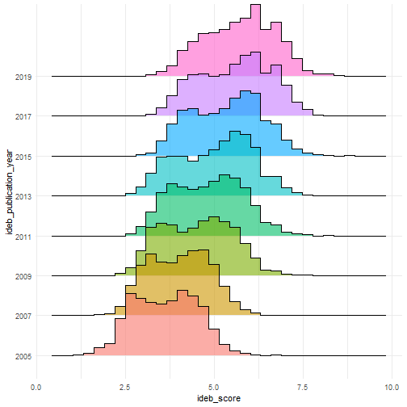
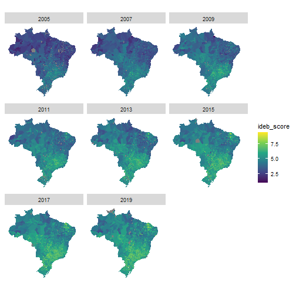
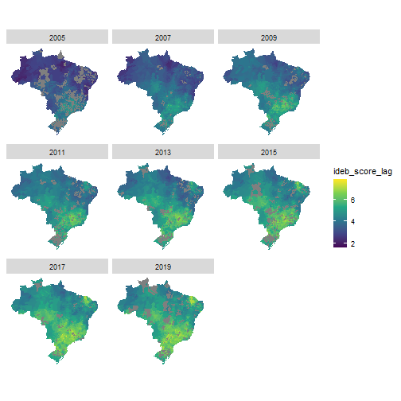

Análise dos resultados do IDEB da 1° à 5° série da rede pública entre 2005 e 2019
========================================================
author: 
date: 
autosize: true

Metodologia
========================================================

### Hipóteses primárias

1. O desempenho do sistema educacional dos municípios brasileiros
evoluiram em taxas de variação semelhantes

### Hipóteses secundárias

1.1 O desempenho no Sistema de Avaliação da Educação Básica (Saeb) ddos municípios brasileiros evoluiram em taxas de variação semelhantes

1.2 O fluxo escolar dos municípios brasileiros evoluiram em taxas
de variação semelhantes

Distribuição do desempenho no IDEB
========================================================

A partir do histograma acima percebe-ce uma tendência de crescimento do desempenho escolar no território brasileiro,
no entanto esse crescimento vem acompanhado de maior variação nos
dados observados. Outrossim, é notório a presença de mais de uma moda na distribuição dessa variável durante todo período de 2005 à 2019, embora neste último ano os valores tendam para pontuações maiores.

Desempenho no IDEB dos municípios brasileiros
========================================================

Segmentando por município e por ano de publicação do IDEB é possível observar a melhoria do desempenho do sistema educacional nos anos inicias do enisno fundamental. Em 2005 existia uma predominância nacional da pontuação entre 2.5 e 5 no IDEB, somente parte dos territórios da região centro-oeste, sudeste e sul alcançaram indicadores acima de 5. Nos anos sucessores, ocorre o espalhamento dessa pontuação, embora ainda restrito às regiões supracitadas.No entanto, em contrapartida aos seus vizinhos, os municípios Cearences ganham maior representatividade nessa faixa de desempenho (entre 5 e 7.5), fenômeno este que se acentua a partir do IDEB de 2011. 

Relação de vizinhança 
========================================================

Para uma visualização melhor dessa suposta discrepância do desempenho do sistema educacional nos munícipios brasileiros, é necessário obter uma medida suavizada baseada nos seus vizinhos. A fim de alcançar esse objetivo utilizou-se a regra de contiguidade da rainha de primeira ordem. 

Temos que a pontuação do IDEB suavizada pelos vizinhos apresentam uma predominância de notas acima de 6 nas regiões sudestes e no
estado do Ceará, o que corroborá a análise acima a partir dos dados não suavizados. Especialmente o estado cearense apresenta uma distância em termos de desempenho escolar muito além dos seus vizinhos. Diante disso, o diagrama de espalhamento de Moran pode auxiliar na visualização desses valores extremos que não seguem o mesmo processo de dependência espacial.
