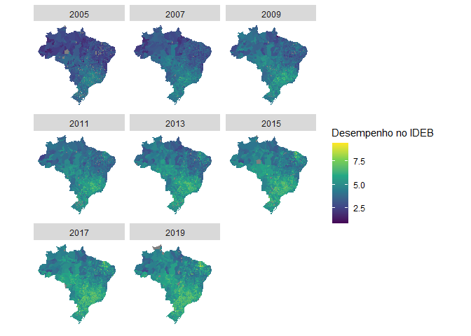

Análise dos resultados do IDEB da 1° à 5° série da rede pública entre
2005 e 2019
================

### Hipóteses primárias

1.  O desempenho do sistema educacional dos municípios brasileiros
    evoluiram em taxas de variação semelhantes

### Hipóteses secundárias

1.1 O desempenho no Sistema de Avaliação da Educação Básica (Saeb) ddos
municípios brasileiros evoluiram em taxas de variação semelhantes

1.2 O fluxo escolar dos municípios brasileiros evoluiram em taxas de
variação semelhantes

### Visão geral do IDEB

### Distribuição do desempenho no IDEB no Brasil

<!-- -->

Percebe-se uma tendência de crescimento, no entanto acompanhado de maior
variação. Outrossim, a presença de mais de uma moda na distribuição
dessa variável durante todo período de 2005 à 2019, embora neste último
os valores tendem para pontuações maiores

### Distribuição do desempenho no IDEB nos municípios brasileiros

<!-- --> Em 2005
existia uma predominância nacional da pontuação entre 2.5 e 5, somente
parte dos territórios da região centro-oeste, sudeste e sul alcançaram
indicadores acima de 5. Nos anos sucessores ocorre a melhoria desses
indicadores, no entanto restritos às regiões supracitadas e, em
contrapartida aos seus vizinhos, os municípios Cearenses ganham maior
representatividade

### Distribuição suavizada do desempenho no IDEB nos municípios brasileiros

<!-- -->

Temos que a pontuação do IDEB suavizada pelos vizinhos apresentam uma
predominância de notas acima de 6 nas regiões sudestes e no estado do
Ceará, o que corroborá a análise acima a partir dos dados não
suavizados. Especialmente o estado cearense apresenta uma distância em
termos de desempenho escolar muito além dos seus vizinhos.

### Diagrama de espalhamento de Moran do desempenho no IDEB

<!-- -->

Fica nítido a maior presença de “ruído” nas pontuações dos primeiros e
mais recentes anos, sobretudo nas edições de 2007 e 2019. No entanto,
embora esses municípios sejam diferentes dos seus vizinhos
(negativamente), estes encontram-se no quadrante de altos entre altos.

### Índice global de Moran do desempenho do IDEB

<!-- -->

Nesse cenário, o índice global de Moran está acima de 0.8 em todas
edições, considerado alta dependência espacial. O indicador atingiu seu
pico na edição de 2011 do IDEB, embora após esse período seguiu
registrando queda constante até 2019, ano de menor dependência espacial.
Ademais, relacionando com as análises anteriores, a publicação com menor
dependência espacial também foi aquela com maior participação de
municípios nos melhores quadrantes do diagrama.

## Mapa de Moran do desempenho do IDEB

<!-- -->

Somos capazes de identificar pelo menos três regiões com desempenho IDEB
semelhantes, são elas: a região norte e nordeste, exceto Ceará, formada
por territórios de baixa performance com vizinhos de baixo desempenho,
seguidamente, a região sudeste e parcialmente a região sul e
centro-oeste com alta pontuação no IDEB e vizinhos igualmente altamente
performáticos, por último, um caso a ser estudado mais profundamente, o
estado Cearense destaque-se tanto na própria região nordeste quanto numa
escala nacional, representando uma “ilha” de alto desempenho escolar nos
anos iniciais do fundamental

## Fluxo escolar

### Distribuição da taxa de aprovação média no Brasil

<!-- -->
<!-- -->

A distribuição dessa variável apresenta alta assimetria negativa, embora
nas três primeiras publicações apresentaram maior heterogeneidade, vindo
a estabilizar nas últimas três edições.

### Distribuição da taxa de aprovação média nos municípios brasileiros

É nítida a maior variação da taxa média de aprovação nas publicações
iniciais do IDEB, sobretudo na região norte e nordeste. No entanto, a
partir do ano de 2009, a região centro-oeste, sudeste e o estado do
Ceará ganham maior participação nas maiores taxas média de aprovação,
acima de 90%.

<!-- --> \#\#\#
Distribuição suavizada da taxa de aprovação média nos municípios
brasileiros

Uma vez suavizada a variável de interesse, percebe-se, sobretudo na
região norte durante o ano de 2005, a acentuação de taxas de aprovação
média entre 50% e 60%. Esse comportamento foi observado no estado do
Amazonas, Bahia e Pará. Em contrapartida, os estados com valores maiores
não foi perceptível uma mudança abrupta quando suavizada.

<!-- -->

### Diagrama de espalhamento de Moran da taxa de aprovação

<!-- --> Temos que os
municípios concentram-se no quadrante de maior taxa média de aprovação
(altos entre altos). É notório a presença de alta variabilidade no
quadrante esquerdo inferior, sobretudo nas edições dos últimos 5 anos.

### Índice global de Moran

<!-- --> Observa-se
uma autocorrelação acima de 70% em todas publicações, indicando alta
dependência espacial. No ano de 2005 atingiu seu valor histórico e na
edição mais recente seu menor valor registrado.

## Desempenho escolar (Nota SAEB)

### Distribuição do desempenho no SAEB no Brasil

<!-- -->

A nota média padronizada do SAEB apresenta amplitude entre 3 e 7 nas
maioria das edições do IDEB. No geral, a distribuição apresenta variação
perceptível, sobretudo na publicação de 2013. No entanto, embora esse
comportamento ocorra, percebe-se uma tendência a pontuações maiores no
decorrer dos anos

### Distribuição do desempenho no SAEB nos municípios brasileiros

<!-- --> O desempenho
no SAEB dos territórios brasileiros apresentam pontuações baixas pelo
menos até 2009, somente a partir da edição de 2011 que regiões com
desempenho inferiores começam a apresentar pontuações acima de 6. Como
visto nas seções anteriores, tanto a região sudeste e o estado do Ceará
apresentam desempenhos superiores.

### Distribuição do desempenho no SAEB suavizado nos municípios brasileiros

É notória a predominância de pontuações entre 4 e 5 no SAEB de 2005.
Diferentemente do IDEB geral, o desempenho no SAEB demorou mais para
apresentar valores superiores a 7. No entanto as regiões seguem o padrão
das análises anteriores.

<!-- -->

### Diagrama de espalhamento de Moran do desempenho no SAEB

<!-- --> Municípios
com desempenhos no quadrante superior direito, representando altos entre
altos, apresentam maior variabilidade, indicando baixa semelhança com
seus vizinhos.

### Índice global de Moran do desempenho no SAEB

<!-- --> Semelhante a
taxa de aprovação, a dependência espacial no SAEB encontra-se acima de
70%, no entanto apresenta um padrão de crescimento até 2011 e de
decrescimento entre 2011 e 2019.

### Mapa de Moran do desempenho no SAEB

<!-- --> Embora o
quadrante de altos entre altos esteja condensado na região sudeste e no
estado do Ceará, percebe-se espalhamento em algumas regiões do
centro-oeste. Outrossim, nota-se a presença de municípios de baixo
desempenho entre territórios de alto desempenho.

## Conclusão

1.  O desempenho do sistema escolar nos anos iniciais registrou
    tendência crescente nas duas dimensões: fluxo escolar e desempenho
    nas provas do SAEB. Embora nesta última resultados superiores foram
    apresentados mais tardiamente.
2.  Observou-se alta dependência espacial e a presença de pelo menos
    três regiões com desempenhos semelhantes, sendo o Ceará aquele com
    pontuações aberrantes e distantes dos seus vizinhos nordestinos.
3.  A taxa de aprovação média foi a dimensão do desempenho escolar com
    melhores valores, apresentando alta assimetria positiva e
    distribuição mais “equitativa” entre os territórios brasileiros.

### Referências

1.  <https://spatialanalysis.github.io/lab_tutorials/Applications_of_Spatial_Weights.html>

2.  <https://mgimond.github.io/Spatial/spatial-autocorrelation-in-r.html>
