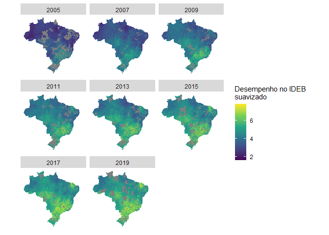

Análise dos resultados do IDEB da 1° à 5° série da rede pública entre
2005 e 2019
================

### Hipóteses primárias

1.  O desempenho do sistema educacional dos municípios brasileiros
    evoluiram em taxas de variação semelhantes

### Hipóteses secundárias

1.1 O desempenho no Sistema de Avaliação da Educação Básica (Saeb) ddos
municípios brasileiros evoluiram em taxas de variação semelhantes

1.2 O fluxo escolar dos municípios brasileiros evoluiram em taxas de
variação semelhantes

### Visão geral

<!-- -->

A partir do histograma acima percebe-ce uma tendência de crescimento do
desempenho escolar no território brasileiro, no entanto esse crescimento
vem acompanhado de maior variação nos dados observados. Outrossim, é
notório a presença de mais de uma moda na distribuição dessa variável
durante todo período de 2005 à 2019, embora neste último ano os valores
tendam para pontuações maiores.

<!-- --> Segmentando
por município e por ano de publicação do IDEB é possível observar a
melhoria do desempenho do sistema educacional nos anos inicias do enisno
fundamental. Em 2005 existia uma predominância nacional da pontuação
entre 2.5 e 5 no IDEB, somente parte dos territórios da região
centro-oeste, sudeste e sul alcançaram indicadores acima de 5. Nos anos
sucessores, ocorre o espalhamento dessa pontuação, embora ainda restrito
às regiões supracitadas.No entanto, em contrapartida aos seus vizinhos,
os municípios Cearences ganham maior representatividade nessa faixa de
desempenho (entre 5 e 7.5), fenômeno este que se acentua a partir do
IDEB de 2011. Para uma visualização melhor dessa suposta discrepância do
desempenho do sistema educacional nos munícipios brasileiros, é
necessário obter uma medida suavizada baseada nos seus vizinhos. A fim
de alcançar esse objetivo utilizou-se a regra de contiguidade da rainha
de primeira ordem.

<!-- -->

Temos que a pontuação do IDEB suavizada pelos vizinhos apresentam uma
predominância de notas acima de 6 nas regiões sudestes e no estado do
Ceará, o que corroborá a análise acima a partir dos dados não
suavizados. Especialmente o estado cearense apresenta uma distância em
termos de desempenho escolar muito além dos seus vizinhos. Diante disso,
o diagrama de espalhamento de Moran pode auxiliar na visualização desses
valores extremos que não seguem o mesmo processo de dependência
espacial.

<!-- -->

A partir do diagrama de espalhamento de Moran é possível deduzir dois
fenomenos característicos da dependência espacial do desempenho no IDEB.
A primeira está relacionada a “diferença” entre o desempenho médio dos
vizinhos, caracterizado pela reta de regressão, e o valor observado do
IDEB. Outrossim, uma vez traçadas as retas médias de ambas variáveis
relacionadas, o diagrama pode ser subdividido segundo quatro grupos, por
exemplo, o quadrante que possui municípios com desempenho no IDEB acima
da média e vizinhos igualmente acima da médio são considerados “altos”
entre “altos”, interpretação semelhante aos quadrantes restantes. Dito
isso, fica nítido o movimento de ascendência do desempenho escolar no
Brasil durante o período analisado, pois em 2005 os municípios
encontravam-se predominantemente no quadrante de baixos entre baixos e
em 2019 encontram-se a maioria de altos entre altos. No entanto, embora
o crescimento da pontuação, observa-se a presença de pontos distantes
negativamente dos seus vizinhos, caracterizando menor semelhança entre
eles.

Ainda, cabe analisar o índice global de Moran entre 2005 e 2019, o qual
mensura o grau efetivo de dependência espacial.

<!-- -->

Nesse cenário, o índice global de Moran está acima de 0.8 em todas
edições, considerado alta dependência espacial. O indicador atingiu seu
pico na edição de 2011 do IDEB, embora após esse período seguiu
registrando queda constante até 2019, ano de menor dependência espacial.
Ademais, relacionando com as análises anteriores, a publicação com menor
dependência espacial também foi aquela com maior participação de
municípios nos melhores quadrantes do diagrama.

<!-- -->

Visualizando geograficamente o diagrama de espalhamento de Moran, somos
capazes de identificar pelo menos três regiões com desempenho IDEB
semelhantes, são elas: a região norte e nordeste, exceto Ceará, formada
por territórios de baixa performace com vizinhos de baixo desempenho,
seguidamente, a região sudeste e parcialmente a região sul e
centro-oeste com alta pontuação no IDEB e vizinhos igualmente altamente
performáticos, por último, um caso a ser estudado mais profundamente, o
estado Cearence destaque-se tanto na própria região nordeste quanto numa
escala nacional, representando uma “ilha” de alto desempenho escolar nos
anos iniciais do fundamental.

### Referências

1.  <https://spatialanalysis.github.io/lab_tutorials/Applications_of_Spatial_Weights.html>

2.  <https://mgimond.github.io/Spatial/spatial-autocorrelation-in-r.html>
